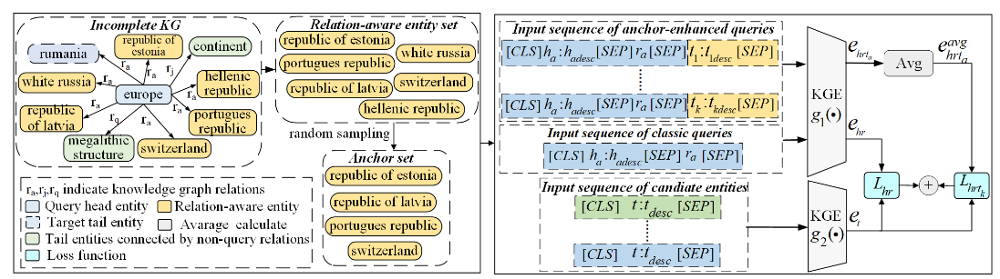

# Knowledge Graph Completion with Relation-Aware Anchor Enhancement

Official code repository for AAAI-25 paper
**["Knowledge Graph Completion with Relation-Aware Anchor Enhancement"](https://arxiv.org/pdf/2504.06129)**

The paper is available at: [[https://aclanthology.org/2022.acl-long.295.pdf](https://aclanthology.org/2022.acl-long.295.pdf)]

---


In this paper, through observation and validation, we find a neglected fact that the relation-aware neighbors of the head entities in queries could act as effective contexts for more precise link prediction. Driven by this finding, we propose a relation-aware anchor enhanced knowledge graph completion method (RAA-KGC). Specifically, in our method, to provide a reference of what might the target entity be like, we first generate anchor entities within the relation-aware neighborhood of the head entity. Then, by pulling the query embedding towards the neighborhoods of the anchors, it is tuned to be more discriminative for target entity matching. The results of our extensive experiments not only validate the efficacy of RAA-KGC but also reveal that by integrating our relation-aware anchor enhancement strategy, the performance of current leading methods can be notably enhanced without substantial modifications.

---

## Requirements

- `python >= 3.7`
- `torch >= 1.6` (for mixed precision training)
- `transformers >= 4.15`

---

## How to Run

For WN18RR and FB15k237 datasets, we use files from [SimKGC](https://github.com/intfloat/SimKGC "GitHub - SimKGC").

For Wikidata5M transductive dataset, we provide a script to download the Wikidata5M dataset from its official website. This will download data for both transductive and inductive settings. The dataset can be found at [Wikidata5M](https://deepgraphlearning.github.io/project/wikidata5m "Wikidata5M Project").


### Acknowledgement
Many thanks to previous works:
- [SimKGC](https://github.com/intfloat/SimKGC)
- [TransE](https://github.com/Anery/transE)
- [Improved Negative Search for Knowledge Graph Completion](https://github.com/Fantabulous-J/Improved-Negative-Search-for-KGC)
- [CompIEx](https://arxiv.org/abs/1606.06357)

If you have any questions about the code, please contact Duanyang Yuan (ydy_n1@nudt.edu.cn)

## Citation

If you find our paper or code repository helpful, please consider citing as follows:

```
@misc{yuan2025knowledgegraphcompletionrelationaware,
      title={Knowledge Graph Completion with Relation-Aware Anchor Enhancement}, 
      author={Duanyang Yuan and Sihang Zhou and Xiaoshu Chen and Dong Wang and Ke Liang and Xinwang Liu and Jian Huang},
      year={2025},
      eprint={2504.06129},
      archivePrefix={arXiv},
      primaryClass={cs.IR},
      url={https://arxiv.org/abs/2504.06129}, 
}
```


